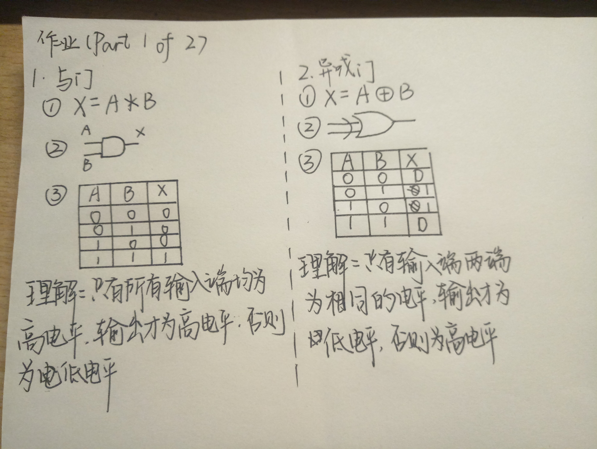
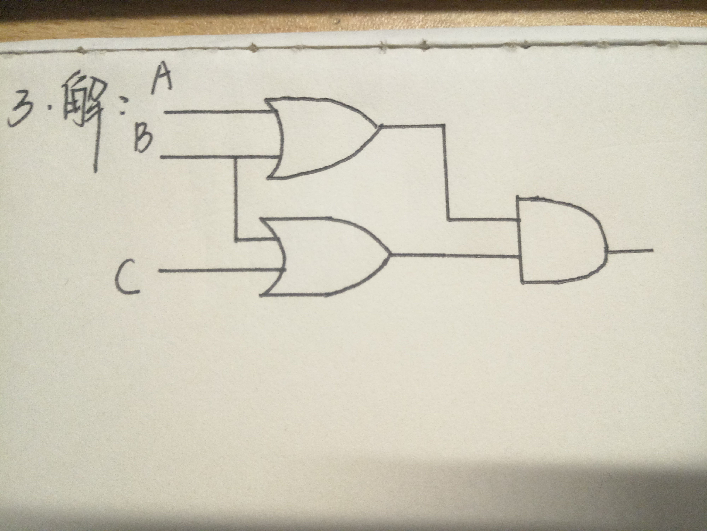
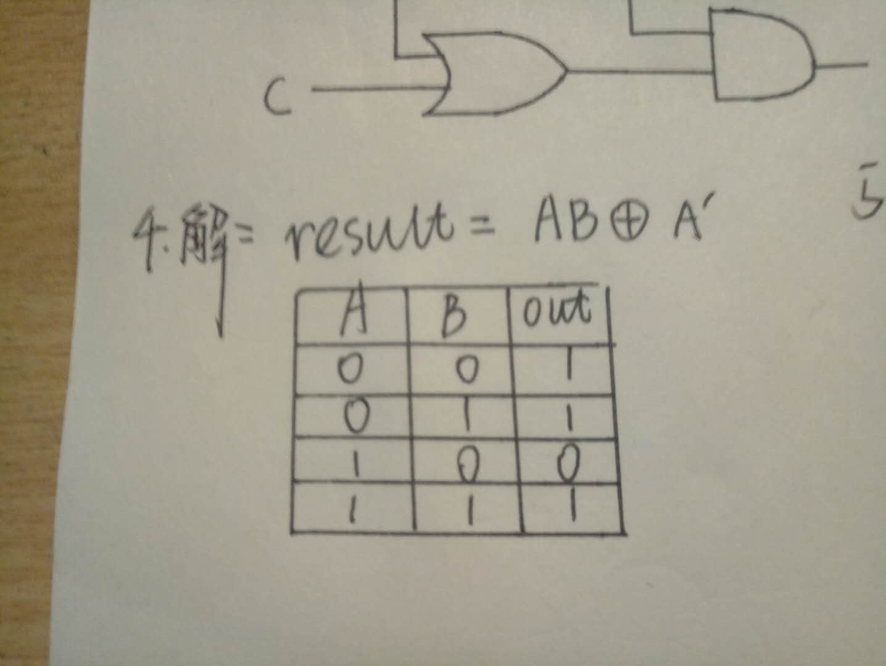
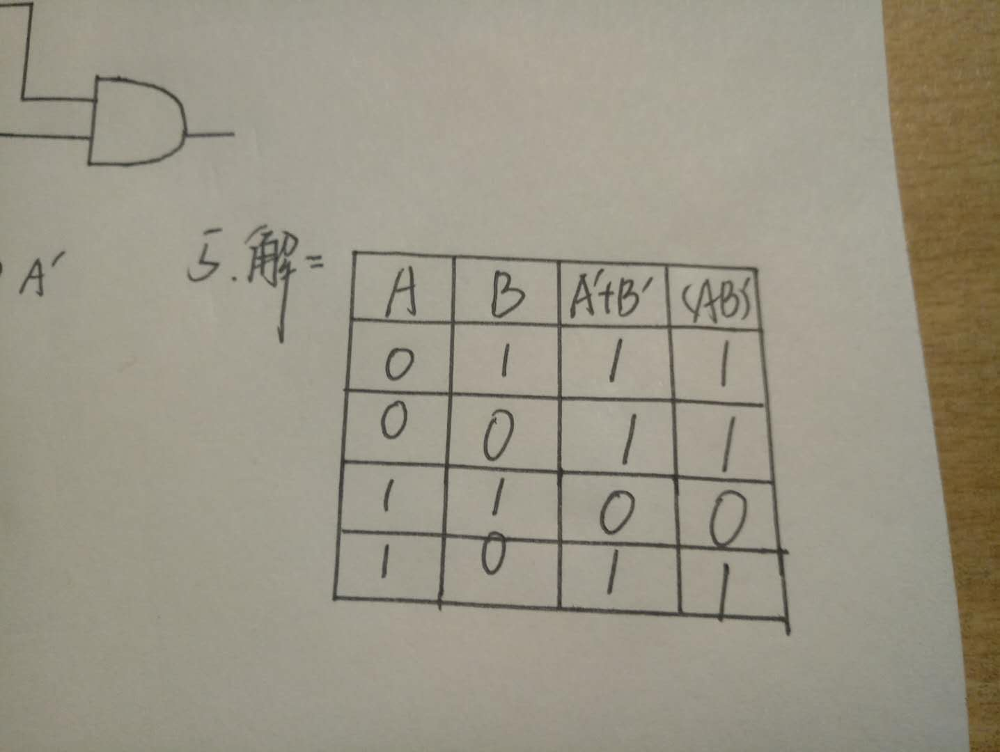

#  第七周作业
### Part 1 of 3
#### 题目1~5如下图

其中第五题回答“What is circuit equivalence"  
答：即两个电路的逻辑运算门电路种类或顺序不同，但最后得出的结果是相同的。  

### Part 2 of 3
7)解：  
(1) X8X7X6X51111  
(2) X8X7X6X5X4'X3'X2'X1'  
(3) X8X7X6X5X4'X3'X2'X1'  
