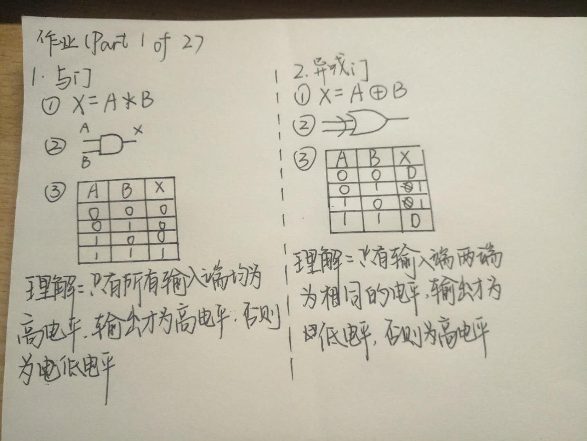
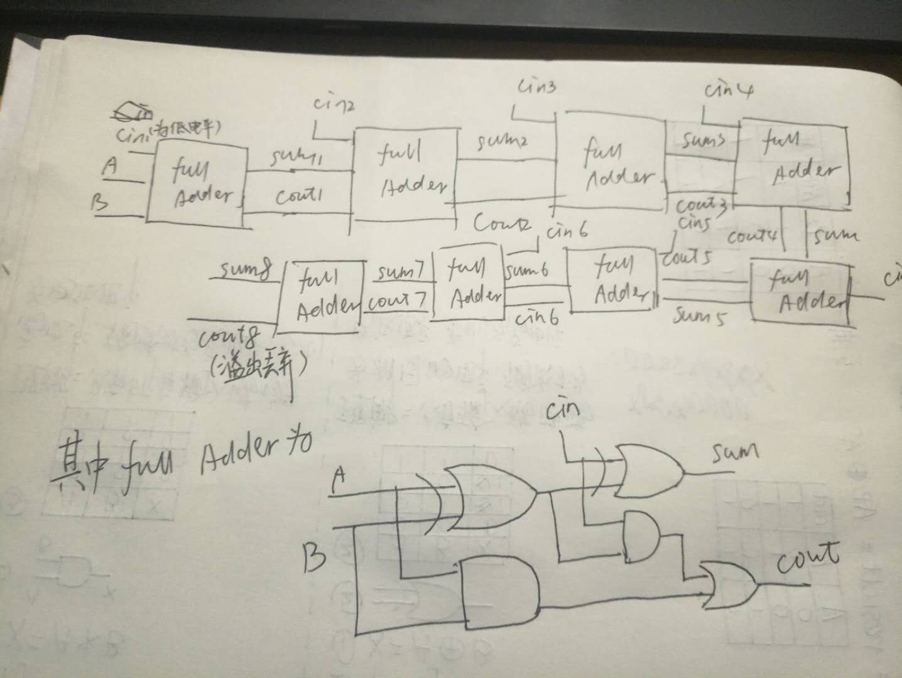

#  第七周作业
### Part 1 of 3
#### 题目1~5如下图

其中第五题回答“What is circuit equivalence"  
答：即两个电路的逻辑运算门电路种类或顺序不同，但最后得出的结果是相同的。  

### Part 2 of 3
6)  
7)解：  
(1) X8X7X6X51111  
(2) X8X7X6X5X4'X3'X2'X1'  
(3) X8X7X6X5X4'X3'X2'X1'  

### Part 3 of 3
#### 使用维基百科，解释以下概念
###### Logic gate
In electronics, a logic gate is an idealized or physical device implementing a Boolean function; that is, it performs a logical operation on one or more binary inputs and produces a single binary output. Depending on the context, the term may refer to an ideal logic gate, one that has for instance zero rise time and unlimited fan-out, or it may refer to a non-ideal physical device (see Ideal and real op-amps for comparison).

Logic gates are primarily implemented using diodes or transistors acting as electronic switches, but can also be constructed using vacuum tubes, electromagnetic relays (relay logic), fluidic logic, pneumatic logic, optics, molecules, or even mechanical elements. With amplification, logic gates can be cascaded in the same way that Boolean functions can be composed, allowing the construction of a physical model of all of Boolean logic, and therefore, all of the algorithms and mathematics that can be described with Boolean logic.  

##### Boolean algebra
In mathematics and mathematical logic, Boolean algebra is the branch of algebra in which the values of the variables are the truth values true and false, usually denoted 1 and 0 respectively. Instead of elementary algebra where the values of the variables are numbers, and the prime operations are addition and multiplication, the main operations of Boolean algebra are the conjunction and denoted as ∧, the disjunction or denoted as ∨, and the negation not denoted as ¬. It is thus a formalism for describing logical relations in the same way that elementary algebra describes numeric relations.

Boolean algebra was introduced by George Boole in his first book The Mathematical Analysis of Logic (1847), and set forth more fully in his An Investigation of the Laws of Thought (1854).[1] According to Huntington, the term "Boolean algebra" was first suggested by Sheffer in 1913,[2] although Charles Sanders Peirce in 1880 gave the title "A Boolian Algebra with One Constant" to the first chapter of his "The Simplest Mathematics".[3] Boolean algebra has been fundamental in the development of digital electronics, and is provided for in all modern programming languages. It is also used in set theory and statistics.
#### 自学存储电路。维基百科：”Filp-flop“，选择中文
1.中文翻译是触发器  
2.1 bit