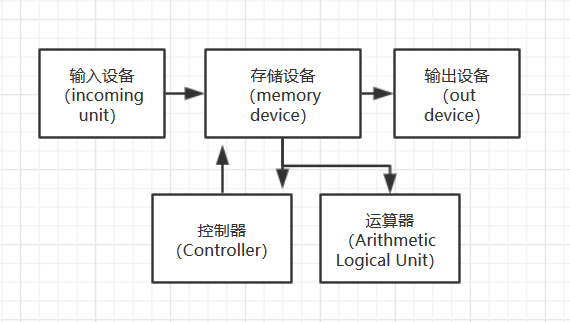

# 第八周作业
### 一、List basic parts of a computer.
冯诺依曼结构下，一台计算机基本单元：存储、控制、运算、输入输出。

### 二、How many bits are needed to address any single byte in memory?
log2(64 * 1024 * 1024) = 26
### 三、List basic parts of a CPU, include cache or not?
主要部分有算术逻辑运算单元（ALU）、控制单元、高速缓冲储存器（cache），所以包括cache  
### 四、What mean secondary storage. List some on your PC. 
按照与CPU的接近程度，存储器通常分为内存储器与外存储器，简称内存与外存。内存储器又常称为主存储器（简称主存），属于主机的组成部分；外存储器又常称为辅助存储器（简称辅存），属于外部设备。Secondary Storage，指与来自主存储的存储器相连的辅助存储设备。如硬盘、光碟、闪存卡、U盘等。
### 五、使用维基百科，解释以下概念
#### CPU
A central processing unit (CPU) is the electronic circuitry within a computer that carries out the instructions of a computer program by performing the basic arithmetic, logical, control and input/output (I/O) operations specified by the instructions. The computer industry has used the term "central processing unit" at least since the early 1960s. Traditionally, the term "CPU" refers to a processor, more specifically to its processing unit and control unit (CU), distinguishing these core elements of a computer from external components such as main memory and I/O circuitry.

#### RAM
Random-access memory (RAM /ræm/) is a form of computer data storage that stores data and machine code currently being used. A random-access memory device allows data items to be read or written in almost the same amount of time irrespective of the physical location of data inside the memory. In contrast, with other direct-access data storage media such as hard disks, CD-RWs, DVD-RWs and the older magnetic tapes and drum memory, the time required to read and write data items varies significantly depending on their physical locations on the recording medium, due to mechanical limitations such as media rotation speeds and arm movement. 
#### ROM
Read-only memory (ROM) is a type of non-volatile memory used in computers and other electronic devices. Data stored in ROM can only be modified slowly, with difficulty, or not at all, so it is mainly used to store firmware (software that is closely tied to specific hardware, and unlikely to need frequent updates) or application software in plug-in cartridges. 
#### BUS(computing 总线)
In computer architecture, a bus(a contraction of the Latin omnibus) is a communication system that transfers data between components inside a computer, or between computers. This expression covers all related hardware components (wire, optical fiber, etc.)and software, including communication protocols.

Early computer buses were parallel electrical wires with multiple hardware connections, but the term is now used for any physical arrangement that provides the same logical function as a parallel electrical bus. Modern computer buses can use both parallel and bit serial connections, and can be wired in either a multidrop (electrical parallel) or daisy chain topology, or connected by switched hubs, as in the case of USB.

#### Parallel Computing
Parallel computing is a type of computation in which many calculations or the execution of processes are carried out simultaneously. Large problems can often be divided into smaller ones, which can then be solved at the same time. There are several different forms of parallel computing: bit-level, instruction-level, data, and task parallelism. Parallelism has long been employed in high-performance computing, but it's gaining broader interest due to the physical constraints preventing frequency scaling. As power consumption (and consequently heat generation) by computers has become a concern in recent years, parallel computing has become the dominant paradigm in computer architecture, mainly in the form of multi-core processors.

### 六、简单解释云计算
云计算 （Cloud Computing）是基于互联网的相关服务的增加、使用和交付模式，通常涉及通过互联网来提供动态易扩展且经常是虚拟化的资源。云是网络、互联网的一种比喻说法。过去在图中往往用云来表示电信网，后来也用来表示互联网和底层基础设施的抽象。因此，云计算甚至可以让你体验每秒10万亿次的运算能力，拥有这么强大的计算能力可以模拟核爆炸、预测气候变化和市场发展趋势。用户通过电脑、笔记本、手机等方式接入数据中心，按自己的需求进行运算

### 七、小孙买了计算机主板，说明书表明“支持双通道 DDR3-1333内存，最大支持16G”
1.DDR3的3是版本的意思，这里指第三代内存。1333指的是时钟频率为1333HZ  
2.能 但内存对性能的提升有限  
3.不能 性能主要与指令长度、时钟周期长、CPI有关。指令集不变的情况下，指令长度、CPI大致不变，时钟周期与主频是倒数关系。  
4.log2(16 *  1024 * 1024) = 34
