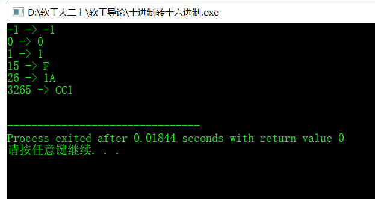

## 第十一周作业
### 1.1}用伪代码描述将十进制转换成16进制的方法
```
/*
算法描述：  
将传入的int数取余16加'0'后按序存入char*中  
因为阅读习惯是高位在左，低位在右  
所以最后还要将字符串数组逆序   
其中如果遇到负数，在逆序前要在最后加'-'   
*/   

//转成的十六进制数用char*来表示,存入str中   
void decToHex(int num,char *str){  
	flag = false	//用来判断是否为负数，如果是负数在char*最后加'-'  
	count = 0	//用来记存入数组的位数   
	if num < 0 then flag = true num = num /-1
    if num == 0 then str[count++] = '0'
	while num>0 do   
		str[count] = num / 10 + '0'   
		num /= 0  
	end  
	if flag then str[count++] = '-'  
	for index 0 to count/2 by 1 do  
		str[index] = str[count - 1 - index]  
	end  
}   
```
### 1.2）C语言实现（先用注释写好算法，然后翻译）
```
/*
算法描述：  
将传入的int数取余16加'0'后按序存入char*中  
因为阅读习惯是高位在左，低位在右  
所以最后还要将字符串数组逆序   
其中如果遇到负数，在逆序前要在最后加'-'   
*/   

#include <stdio.h>

void transHex(int num, char *str){
	bool flag = true;
	int count = 0;
	if(num < 0) {
		num /= -1;
		flag = false;
	}
	if(num == 0) str[count++] = '0';
	while(num){
		if(num % 16 > 9)
			str[count] = num % 16 - 10 + 'A'; 
		else str[count] = num % 16 + '0';
		count++;
		num /= 16;
	}
	if(flag == false)str[count++] = '-';
	for(int i = 0;i < count / 2; i++){
		char ch = str[i];
		str[i] = str[count - 1 - i];
		str[count - 1 -  i] = ch;
	}
	str[count] = '\0';
}
int main()
{
	int num;
	char str[200];
	int arr[] = {-1, 0, 1, 15, 26, 3265};
	int length = sizeof(arr) / sizeof(int);
	for(int i = 0; i < length; i++){
		transHex(arr[i], str);
		printf("%d -> %s\n",arr[i],str);
	}
	printf("\n");
	
}
```
### 1.3）使用 -1,  0,  1,  15,  26，3265 作为输入测试你的程序
结果如下图  


### 2.名词解释与对比
#### 1)Top-down design
A top-down approach (also known as stepwise design and in some cases used as a synonym of decomposition) is essentially the breaking down of a system to gain insight into its compositional sub-systems in a reverse engineering fashion. In a top-down approach an overview of the system is formulated, specifying, but not detailing, any first-level subsystems. Each subsystem is then refined in yet greater detail, sometimes in many additional subsystem levels, until the entire specification is reduced to base elements. A top-down model is often specified with the assistance of "black boxes", which makes it easier to manipulate. However, black boxes may fail to clarify elementary mechanisms or be detailed enough to realistically validate the model. Top down approach starts with the big picture. It breaks down from there into smaller segments.   


自上而下的方法（也称为逐步设计，在某些情况下用作分解的同义词）本质上是系统分解，以便以逆向工程的方式深入了解其组成子系统。在自顶向下的方法中，系统的概述被制定，指定，但不详细说明，任何第一级子系统。然后对每个子系统进行更详细的细化，有时在许多附加的子系统级别中进行细化，直到整个规范被简化为基本元素。

#### 2)Work breakdown structure (WBS)
A work-breakdown structure (WBS) in project management and systems engineering, is a deliverable-oriented breakdown of a project into smaller components. A work breakdown structure is a key project deliverable that organizes the team's work into manageable sections. The Project Management Body of Knowledge (PMBOK 5) defines the work-breakdown structure "A hierarchical decomposition of the total scope of work to be carried out by the project team to accomplish the project objectives and create the required deliverables." 

在项目管理和系统工程中，工作分解结构（WBS）是面向交付的项目分解为更小的组件。工作分解结构是一个关键的项目交付，将团队的工作组织成可管理的部分。项目管理知识体系（PMBOK 5）定义了工作分解结构“项目团队为了完成项目目标和创建所需的可交付成果而要执行的总工作范围的分层分解”。

#### 3)简述管理学WBS 与信息学Top-down设计的异同
相同：他们二者都是将一个系统分解成更小的部分  
不同点: 管理学WBS的分解可能更加倾向同类同级事件的分解，而信息学Top-down设计更加倾向于将一个事件按主次分解  

#### 4.1）请使用伪代码分解“正常洗衣”程序的大步骤。包括注水、浸泡等
1. 选择洗衣模式、注水高度  
2. 注水到一定高度
3. 电机转动左三次右三次
4. 排水过滤，注水到一定高度，浸泡
5. 排水后脱水（电机转动）
6. 结束

#### 4.2）进一步用基本操作、控制语句（IF、FOR、WHILE等）、变量与表达式，写出每个步骤的伪代码
```
    Read 使用者选择的洗衣模式
    Read 使用者选择的注水高度depth
    for counter 1 to 2 by 1
        water_in_switch(open) 
        if get_water_volume() == depth 
        then water_in_switch(close) 
        for counter 1 to 3 by 1
            motor_run(left)
        end
        for counter 1 to 3 by 1
            motor_run(right)
        end
        water_out_switch(open) 
        water_out_switch(close) 
    end
    halt(success)
    for counter 1 to 3 by 1
            motor_run(left)
    end
    for counter 1 to 3 by 1
        motor_run(right)
    end
```
#### 4.3)据你的实践，请分析“正常洗衣”与“快速洗衣”在用户目标和程序上的异同。你认为是否存在改进（创新）空间，简单说明你的改进意见
相同点：均有漂洗、脱水  
不同点：快速洗衣没有浸泡  
改进意见：增加洗衣机电动机转动的方向  

#### 4）通过步骤3），提取一些共性功能模块（函数），简化“正常洗衣”程序，使程序变得更利于人类理解和修改维护。
Rinse() // 漂洗方法
Dehydration() // 脱水方法