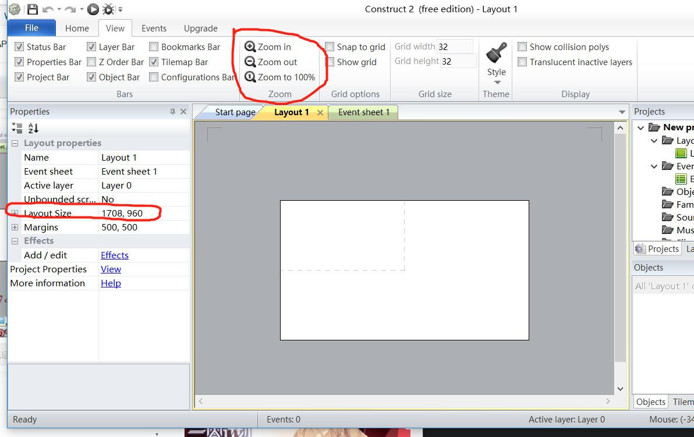

# 以Construct 2制作平台游戏的新手指南
相信有很多同学和我一样学习编程的一个动力是自己设计出一个游戏，在还没设计出一个比较宏大的游戏前，我们能够使用Construct 2创造任何类型的2D游戏，而且不需要任何一行代码。这篇文章将要阐述我怎么使用Construct2制作一款射击游戏。

### 安装工作
最新版本的construct是construct3，但是为了更加方便的获得教程，我们还是选用construct2。尽管construct2编辑器只适用于Windows，但是我们制作的游戏可以运行在任何平台上。
[下载链接](http://www.pc0359.cn/downinfo/38823.html)

### 创建项目文件及界面介绍
1. 创建项目文件  
(i)【ctrl+N快捷键】或【File->New】   
(ii)【New empty project】
2. 界面介绍  
(i)【Layout 1】就是我们的可视化场景  
(ii)【Zoom out】上面红色画圈部门Zoom out可以缩小场景以便我们控制  
(iii)左边【layout size】就可以调整整个layout的大小，只有虚线区域内是可视的

3. 创建背景  
（i)双击背景灰色区域，弹出菜单  
（ii)选择【9-patch】  
（iii)在layout中选中背景覆盖区域后在弹出页面选择打开文件夹，选中图片即可  

4. 添加角色
【注意】要先将原来的背景图层锁定后增添新图层后再操作  
   
和背景一样操作，不过添加的是Sprite元素

### 添加角色行为
(i)右下角Object框体，右键选择待添加行为的角色（以主人公为例)  
(ii)点击Behavious,选中【8directions】（即键盘上下左右可以控制移动）  

## 添加互动行为
(i)选中【Event sheet】选项卡  
(ii)选择【Add event】添加单次行为（具体见英文描述）  
（ii）在添加完之后在后面继续【Add action】可产生联动效果  

## 播放程序
【Home】→【Run layout】  

## 最终效果  

## 相关教学视频
[C2/Construct2游戏制作教程](https://www.bilibili.com/video/av1388302?from=search&seid=4200178113696622671)  
感谢B站up主 [@oeasy](https://space.bilibili.com/2884629/#/)