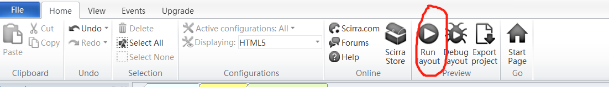

## 螃蟹与海怪游戏设计
### 游戏背景
海洋世界已风平浪静许久，不料，一群海怪蜂拥而至。而就在这时，一向横行霸道的螃蟹一改傲慢形象，这次站在正义的一方为海洋世界铲除海怪。  
### 游戏特色
螃蟹可以发射子弹，通过鼠标可以控制螃蟹子弹的瞄向，单击即发出子弹，通过键盘“↑↓←→”可以控制螃蟹位置。海怪会从四面八方而来，每只海怪有三滴血，螃蟹的每次子弹只能扣除海怪一滴血。
### 添加角色行为
(i)右下角Object框体，右键选择待添加行为的角色（以主人公为例)  
(ii)点击Behavious,选中【8directions】（即键盘上下左右可以控制移动）  

## 添加互动行为
(i)选中【Event sheet】选项卡  
(ii)选择【Add event】添加单次行为（具体见英文描述）  
（ii）在添加完之后在后面继续【Add action】可产生联动效果  

## 播放程序
【Home】→【Run layout】  

### 游戏截图

### 相关教学视频
[C2/Construct2游戏制作教程](https://www.bilibili.com/video/av1388302?from=search&seid=4200178113696622671)  
感谢B站up主 [@oeasy](https://space.bilibili.com/2884629/#/)