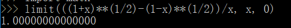
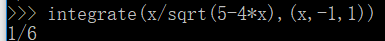
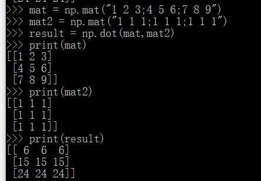
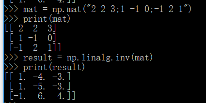

## python科学计算 实验报告
### 实验目的
1. 了解一种解释型语言python  
2. 使用python 做一些简单的科学计算  
3. 学会LaTeX基本语法
### 实验环境
1. 编程工具：Python(winpython / Acnaconda)  
2. 操作系统：Windows  
### 实验内容
#### 1.选择2个高等数学上的作业，如泰勒分解、公式化简、解方程等。 （一般搜索不到有价值的答案）
$$ \lim_{x \to 0} \frac{\sqrt{1+x} - \sqrt{1-x}}{x} $$  

$$ \int_{-1}^{1}  \frac{xdx}{\sqrt{5-4x}}$$

#### 2.选择2个线性代数上的作业，如求dot、逆矩阵等，最好会解方程。（建议阅读《用Python做科学计算》）

$$
\begin{equation}
{
\left(
\begin{array}
11 & 2 & 3\\
4 & 5 & 6\\
7 & 8 & 9
\end{array}
\right )}
{
\left(
\begin{array}
11 & 1 & 1\\
1 & 1 & 1\\
1 & 1 & 1
\end{array}
\right )}
\end{equation}
$$

$$
\begin{equation}
{
\left(
\begin{array}
12 & 2 & 3\\
1 & -1 & 0\\
-1 & 2 & 1
\end{array}
\right )}^{-1}
\end{equation}
$$

