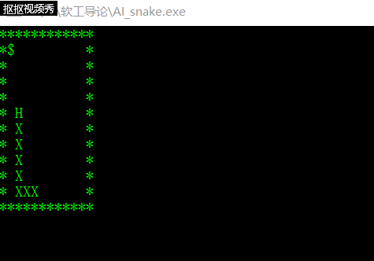

## 字符游戏-智能蛇实验报告
### 一、游戏创新之处
玩家无需控制，蛇便会按照合适路径找到食物并吃掉

### 二、游戏表示
给定一个10 * 10的字符矩阵表示蛇的生存空间,其中有一条长度5的蛇(HXXXX), “H”表示蛇头,“X”表示蛇身体。空间中可能有食物（“$”表示）和障碍物（“*”表示）  
当蛇头碰到自己的身体或走出边界,游戏结束。

### 三、编程实现
与基本的贪吃蛇类似。但是新加入几个全局变量以及修改几个相关函数。  
1.新加入的全局变量  
```
//分别记录SNAKE_FOOD的横纵坐标以及SNAKE_HEAD的横纵坐标
int food_x;
int food_y;
int head_x;
int head_y;

```
2.main函数的修改
```
int main(){
	put_money();
	//output the matrix
	output();
	char ch;
	while(true){
		//此处发生改变，不是由用户输入而改由程序通过whereGoNext()自动计算
        ch = whereGoNext(head_x, head_y, food_x, food_y);
		if(ch >= 'a' &&  ch <= 'z')
			ch = ch - 'a' + 'A';
		switch(ch){
			case 'A': snakeMove(-1, 0); break;
			case 'D': snakeMove(1, 0); break;
			case 'W': snakeMove(0, -1); break;
			case 'S': snakeMove(0, 1); break;
		}
		if(flag_eat == 1){
			flag_eat = 0;
			put_money();
		} 
		output();
		if(flag_over) gameover();
		Sleep(100);
	}
	
}
```
3.新加入的whereGoNext()方法
```
char whereGoNext(int headX, int headY, int foodX, int foodY){
    //记录应该返回的操作字符
	char movable[5] = {'A' , 'D', 'S', 'W'};

    //初始化ADSW操作之后离食物的距离
    //若ADSW操作之后为撞墙或者吃到自己，设距离为很大的数，此处为9999
	int distance[5] = {0, 0, 0, 0};
	if(map[headY][headX-1] == ' ' || map[headY][headX-1] == SNAKE_FOOD){
		distance[0] = abs(foodX - (headX - 1)) + abs(foodY - headY);
	}
	else distance[0] = 9999;
	
	if(map[headY][headX+1] == ' ' || map[headY][headX+1] == SNAKE_FOOD){
		distance[1] = abs(foodX - (headX + 1)) + abs(foodY - headY);
	}
	else distance[1] = 9999;
	
	if(map[headY+1][headX] == ' ' || map[headY+1][headX] == SNAKE_FOOD){
		distance[2] = abs(foodX - headX) + abs(foodY - (headY+1));
	}
	else distance[2] = 9999;
	
	if(map[headY-1][headX] == ' ' || map[headY-1][headX] == SNAKE_FOOD){
		distance[3] = abs(foodX - headX) + abs(foodY - (headY-1));
	}
	else distance[3] = 9999;
	
    //通过与distan和index的比较得出最小的距离及下标
	int distan = 9999;
	int index = 9999;
	for(int i = 0; i < 4; i++){
		if(distance[i] < distan) {
			distan = distance[i];
			index = i;
		}
	}
	if(index == 9999)  return movable[0];
	else return movable[index];
} 
```

### 四、游戏截图
